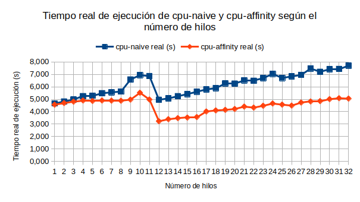
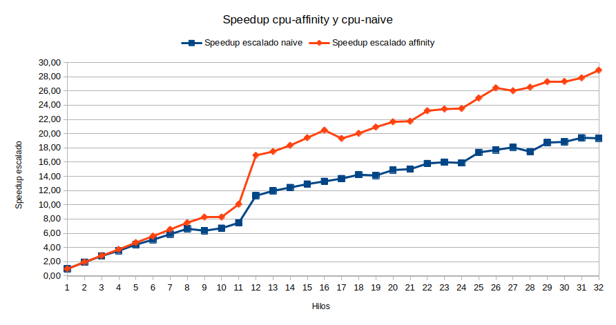
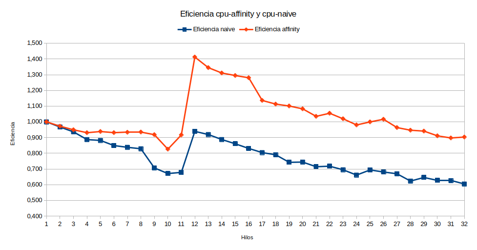
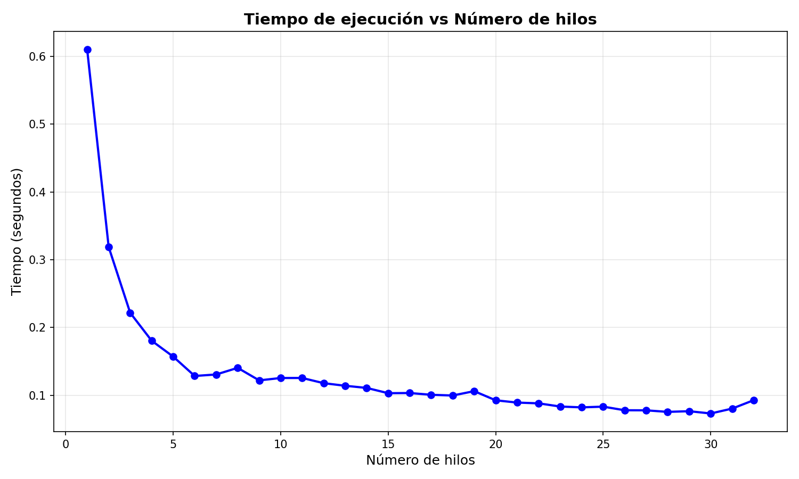
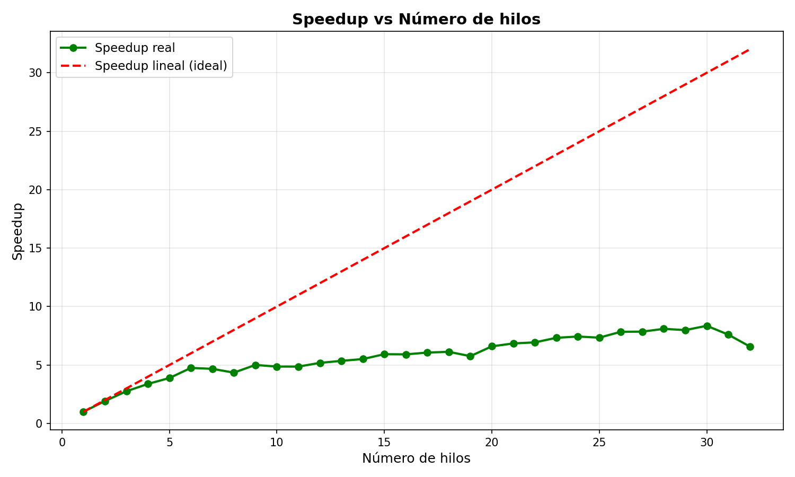
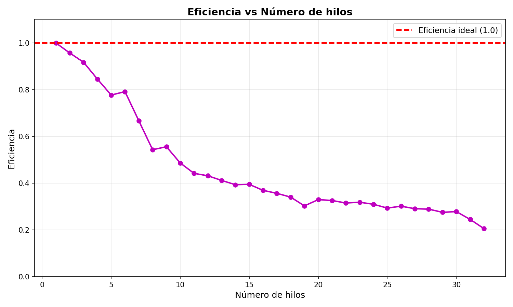
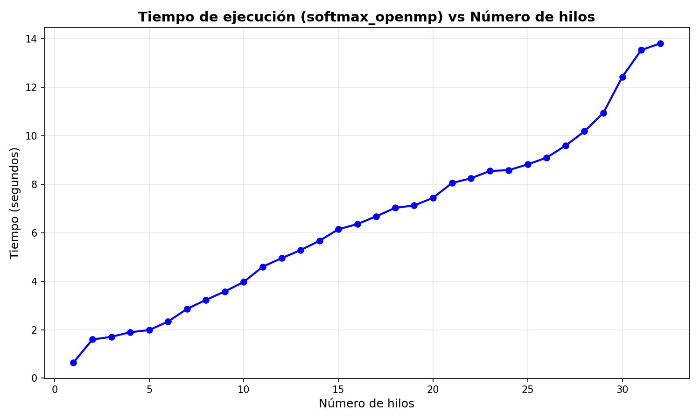
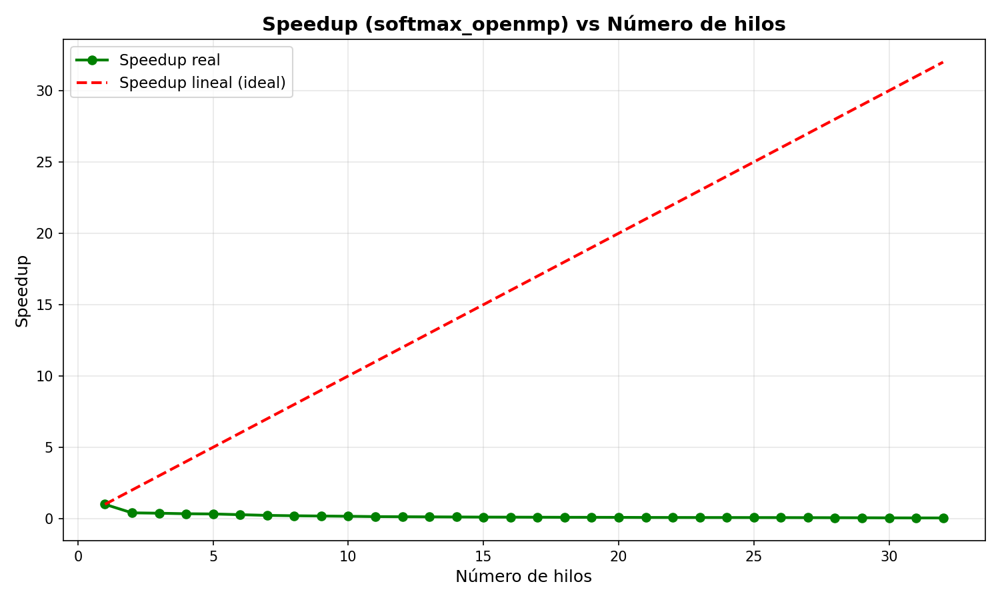
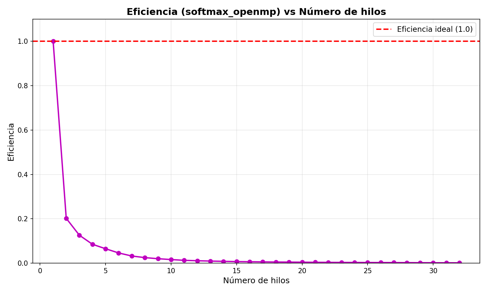

# Semana 4 - Laboratorio 3

En este laboratorio se realizaron pruebas con diferentes cantidades de hilos para observar cómo cambia el rendimiento de varios programas al utilizar paralelismo.

Las pruebas se realizaron variando la cantidad de hilos desde 1 hasta 32.

## Inciso A - Threading

Para este inciso se utilizaron los programas `cpu-naive` y `cpu-affinity`.

Se ejecutaron ambos programas utilizando desde 1 hasta 32 hilos y se midió el tiempo real de ejecución.

### Tiempo de ejecución

En general, `cpu-affinity` presentó mejores tiempos que `cpu-naive`, principalmente cuando se utilizaron más hilos. La diferencia entre ambos programas se debe a que `cpu-affinity` fija los hilos a determinados procesadores, mientras que en la versión `cpu-naive` el sistema operativo puede mover los hilos entre diferentes procesadores durante la ejecución.

También se puede observar que aumentar la cantidad de hilos no siempre significa obtener un menor tiempo de ejecución.

### Speedup

En estos programas el trabajo total aumenta al aumentar la cantidad de hilos, ya que cada hilo procesa su propio bloque de datos. Debido a esto se utilizó un speedup escalado:

`S(p) = (p * T1) / Tp`

donde `p` es la cantidad de hilos, `T1` es el tiempo utilizando un hilo y `Tp` es el tiempo utilizando `p` hilos.

La versión con afinidad presenta un mejor crecimiento que la versión naive, aunque el comportamiento no es completamente lineal.

### Eficiencia

La eficiencia se calculó utilizando:

`E(p) = S(p) / p`

Conforme aumenta la cantidad de hilos, la eficiencia de `cpu-naive` tiende a disminuir. La versión con affinity mantiene una mejor eficiencia durante buena parte de las pruebas.

Un comportamiento particular aparece alrededor de los 12 hilos. Durante las pruebas, la computadora fue conectada a la corriente aproximadamente en ese punto. Esto cambió las condiciones de ejecución y produjo una disminución importante en algunos tiempos, especialmente en `cpu-affinity`. Por esta razón aparecen valores de eficiencia mayores a 1. Estos valores no significan que se superó una eficiencia ideal del 100%, sino que el tiempo utilizado como referencia para un hilo fue obtenido bajo condiciones de alimentación diferentes.

En este inciso una gran parte del trabajo puede ejecutarse de forma independiente entre los hilos. Sin embargo, el rendimiento también depende del acceso a memoria, la planificación de los hilos y las condiciones del procesador.

---

## Inciso B - Scaling

Para este inciso se probaron los programas `matmul_tiled_openmp` y `softmax_openmp`. De nuevo se realizaron pruebas variando la cantidad de hilos desde 1 hasta 32.

### Multiplicación de matrices

Para `matmul_tiled_openmp` se utilizaron los siguientes parámetros:

- Matriz de 512 x 512
- Tile de 32
- 10 repeticiones

#### Tiempo de ejecución

El tiempo disminuye al aumentar la cantidad de hilos, especialmente durante los primeros hilos utilizados. Después de cierta cantidad de hilos la mejora comienza a ser menor, por lo que agregar más hilos ya no produce el mismo beneficio.

#### Speedup

El speedup aumenta conforme se agregan hilos, pero no alcanza el comportamiento ideal. Esto se debe a que existen partes del programa que no se benefician de agregar más hilos y también existen costos asociados al paralelismo.

#### Eficiencia

La eficiencia disminuye conforme aumenta la cantidad de hilos. Esto muestra que llega un punto donde utilizar más recursos produce cada vez menos mejora en el tiempo. La multiplicación de matrices tiene una cantidad importante de trabajo que puede realizarse en paralelo, por lo que obtiene una mejora clara al utilizar varios hilos.

### Softmax

Para `softmax_openmp` se utilizaron:

- 1000 elementos
- 100000 repeticiones

#### Tiempo de ejecución

En este caso se observa un comportamiento diferente. El tiempo aumenta conforme se utilizan más hilos.

#### Speedup

El speedup disminuye al agregar hilos, por lo que para este problema utilizar más hilos no produce una mejora.

#### Eficiencia

La eficiencia también disminuye rápidamente.

Esto ocurre porque el softmax trabaja solamente con 1000 elementos y realiza varias regiones paralelas durante cada repetición. El trabajo realizado dentro de cada región es pequeño comparado con el costo de crear, sincronizar y administrar los hilos.

En este caso, aunque existen partes del algoritmo que pueden ejecutarse en paralelo, el costo del paralelismo termina siendo mayor que la mejora obtenida.

## Conclusiones

Las pruebas muestran que utilizar más hilos no garantiza automáticamente un mejor rendimiento.

En la multiplicación de matrices sí se obtiene una mejora importante al aumentar los hilos, aunque llega un punto donde la eficiencia empieza a disminuir.

En el caso de softmax ocurre lo contrario, ya que el problema es pequeño y el costo de manejar los hilos termina afectando el rendimiento.

También se observó en el inciso A que otros factores del sistema, como la afinidad de los hilos y las condiciones de alimentación de la computadora, pueden afectar bastante los resultados obtenidos.